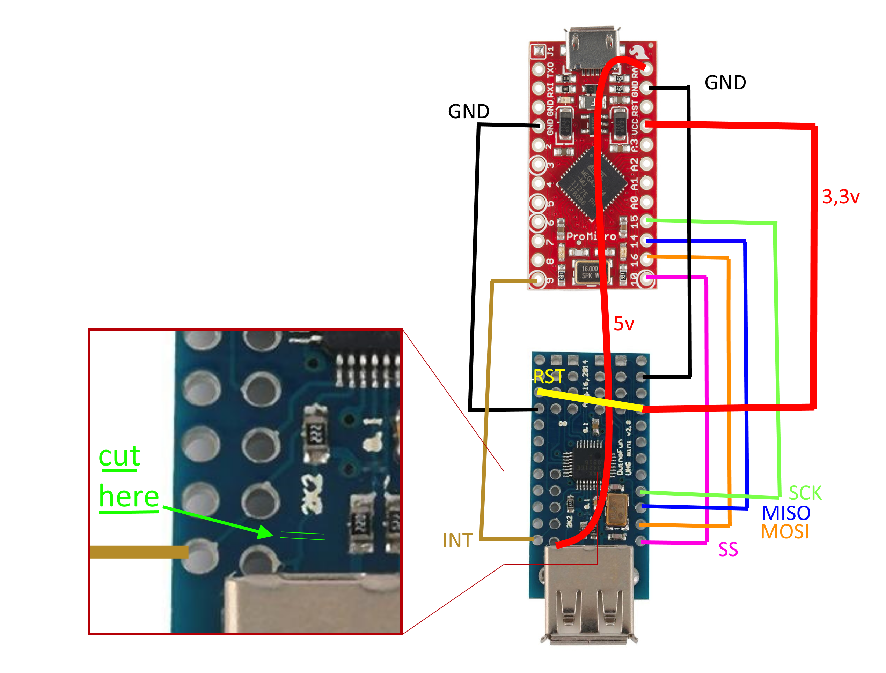
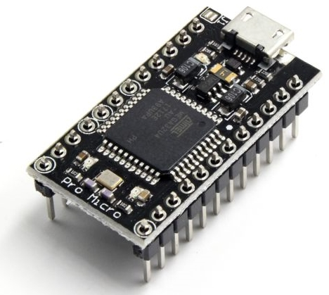

# XBOX 360 Controller to Nintendo Switch converter
This code is a unification of wchill's SwitchInputEmulator https://github.com/wchill/SwitchInputEmulator and felis's USB Host Shield 2.0 XBOX 360 example https://github.com/abcminiuser/lufa

Works with the Pro Micro 3.3v and the USB Host Shield Mini

#Hardware



Prepare the USB HOST SHIELD:
* Cut as shown in the image to seperate the USB host power from the Board.
* Connect reset with 3.3v

If you have a chinese Host shield:
* the labels on the back side can be wrong. Mostly the labels for CLK and MOSI are swapped.

Prepare the Pro Micro 3.3v
* Connect the USB and Measure the voltage between GND and VCC. It should be 3.3v
* (Optional but recommended: Connect the pro micro and the Host shield via  and run the Quality Check (Arduino: File > Examples > USB HOST SHIELD Library 2.0 > qc_board))
* Solder Pins on: 2xGND, INT, VCC(3.3v), SCK, MISO, MOSI and SS.
* Solder a cable between RAW(pro micro) and the USB Host power. This connection provides the 5v for the USB Host
* Solder the pins from the Pro Micro to the Usb Host Shield
* Run the quality check and open a Serial-Terminal

Some error output:
* "00": You deactivated the Serial in the USB host Library.
* "Revision is 0": VCC, or either miso,mosi,ss are not connected correctly
* "Waiting for Device": 3 Possible source of error. 1st No device connected to USB host shield. 2nd You didn't cut off properly the USB HOST Power from the shield. 3rd the vcc from the Board deliver more than 3.3v . You have either the wrong board or your voltage regulator on the board is faulty.(i had this issue that my 8Mhz/3.3v board doesn't regulate the voltage correctly, i fixed this with a 460 Ohm Resistor between VCC and the Shield. Optimal would be a 533 Ohm Resistor, but i didn't recommend this solution)

I've found a pro micro clone for 3.31€ and the Shield for 3.51€ on Ali Express. There are also some plug&play adapters for ~10€. So you save only ~4€ with this project. My Pro Micro 3.3v looked like this. 

The Pins are the same, but the board is wider. So the Board doens't fit exatly under the Shield.

#Building
In Release Section are the already with Arduino compiled hex files.

The Problem with this project is, combining the LUFA library with the USB HOST SHIELD library. The Lufa library implements its own serial communication and that doens't work with the Arduino kernel.

* First of all Install the Lufa Library: https://github.com/Palatis/Arduino-Lufa/blob/master/docs/manual_installation.md
* I'm using following structure: `Arduino_LUFA\libraries\LUFA\LUFA\Drivers\USB`
* Try to compile the LUFA example. If you Get any errors with `<LUFA/LUFA/...>`. Locate the file and replace the line with  `<LUFA/...>`.
* Install the Host Shield Library: `Sketch > Include Library > Manage Libraries... : USB HOST SHIELD Library 2.0 by Oleg Mazurov: Install`
* Now you need to remove the Serial communication:
in `User\Documents\Arduino\libraries\USB_HOST_SHIELD_Library_2.0\` find each line with `USB_HOST_SERIAL.print` and comment it out or surround it with `#ifndef NO_SERIAL ... #endif`. in settings.h replace 
```
#ifndef USB_HOST_SERIAL
#define USB_HOST_SERIAL Serial
```
with 
```
#define NO_SERIAL

#ifndef NO_SERIAL
#ifndef USB_HOST_SERIAL
#define USB_HOST_SERIAL Serial
#endif
#endif
```
or comment it out
(with sublime 3 you can search for `^\h*USB_HOST_SERIAL.*;$` and replace with `#ifndef NO_SERIAL \n$&\n#endif` in all files at once)

if you want to use serial again, then just comment `#define NO_SERIAL` out